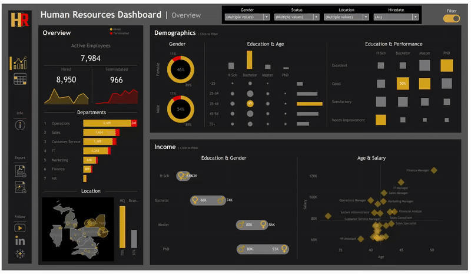

Special thanks to Baraa Khatib Salkini for the tutorial that guided the dashboard build.
**Project:** Interactive Tableau dashboard for HR

# hr-dashboard-LP (learning project)
A polished, dark-themed HR dashboard - Overview workspace (Overview / Demographics / Income) and Employee List details. 
Designed for HR managers to get fast executive insight and then drill to individual employees.

## Overview
A compact, interactive HR dashboard that gives HR managers a fast executive snapshot plus drill-down employee detail. 
The workbook is organized into Summary (Overview, Demographics, Income) and Employee Records tabs so users can move from high-level trends to individual records.

## Landing / Overview
- **KPI** tiles for Total Hired, Active Employees, and Terminated (current view).
- Yearly **Hires vs Terminations** trend (small line charts).
- **Departments** bar chart with terminated counts highlighted (red) and ability to drill to job titles.
- **HQ vs Branches comparison** (HQ = New York) and a US map showing employee counts by city/state with point sizing.
- Click any element to filter the entire summary area.

## Demographics
- **Gender ratio** (donut / stacked bar) with percent labels and separate male/female breakdowns.
- **Age groups distribution** (cohort counts) and Education level bar chart.
- **Education × Performance matrix** (grid/heatmap) showing performance rating distribution by education level.

## Income Analysis
- **Education & Gender** salary summary.
- **Age vs Salary** scatter with department color-coding and trend lines; annotations for common roles (e.g., Sales Manager, Finance Manager).

## Employee List
- Wide, searchable employee list with columns: Employee ID, Full Name, Job Title, Department, Location (City / State), Salary, Status (Hired/Terminated), Hire/Termination dates, and Length of Employment (bars).
- Powerful header filters: Employee ID/full name search, drop-downs for Gender, Age Group, Education Level, Department, Job Title, Location, Salary slider, Status, Year of Hire/Terminate, and Length of Hire slider.
- Quick actions: row hover shows tooltips; click an employee to highlight on maps/charts; Export / CSV option available.

## Interactions & UX
- Global filters apply across both left summary and right details.
- Hover tooltips with metric details, click-to-filter and cross-highlighting between charts, and a compact export button.
- Default view emphasizes Overview KPIs and map, while the right panel stays visible for immediate record lookup.

## Files in this repository
- `dataset/` — dataset used in this exercise  
- `README.md` — this file  
- `images/` — icons, images used
- `mockups.drawio` — mockup use in designing dashboard

## How to open / use
1. click tableau publick link
   link: tableau public - https://public.tableau.com/app/profile/rowel.andrew.legaspi/viz/HRdashboard-LP/HRSummary

## Contact
Rowel Andrew Legaspi (Drew)  
- LinkedIn: https://www.linkedin.com/in/rowel-andrew-legaspi-289936241/
- Tableau Profile: https://public.tableau.com/app/profile/rowel.andrew.legaspi
